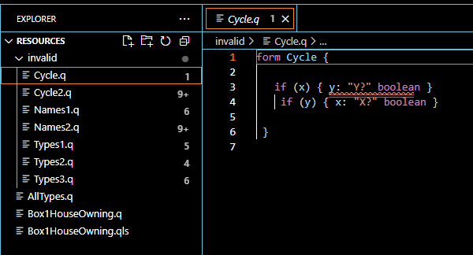

# LWB 25: Questionnaire


### Structure:
As MontiCore is a tool without its own user interface, 
 Gradle is used to invoke MontiCore and build this project.
 * [build.gradle](build.gradle), [gradle.properties](gradle.properties), 
 [settings.gradle](settings.gradle): Gradle setup
 * [src/main/grammars](src/main/grammars): contains the grammar files defining 
 the syntax of both grammars.
 * [src/main/java](src/main/java): contains the handwritten (Java) files for 
 the context conditions and generator
 *  [src/main/resources](src/main/resources): contains the FreeMarker templates
    * [widget](src/main/resources/q/widget): contains the templates for input 
    options, such as a dropdown, a number, a slider, etc.
 * [src/test/java](src/test/java): contains  
   * [src/test/resources](src/test/resources): contains test questionnaire and 
     questionnaire styling models
     * [invalid](src/test/resources/invalid): contains explicitly incorrect 
     models to trigger the CoCo tests
* _build/generated-sources/_
  * _monticore/_: target directory for the MontiCore (DSL)
   generator, containing the resulting AST, ST, etc. classes.
  * _Questionnaire/language-server/_: target directory for the LSP-based editor.
* _genout/_: target of the Q-GUI-Generator, containing the resulting HTML files

Executing the `gradle runGenerator` command performs checking & generation on 
the [Box1HouseOwning.q](src/test/resources/Box1HouseOwning.q) model.
The [genout](genout/) directory now contains the resulting HTML file.

Executing the `gradle runQuestionnaireVscodePluginAttached` command launches 
 VSCode with the Questionnaire DSL editor running.

An example of the _src/test/resources/_ models opened within the editor can be 
seen in the following picture:

The semantic error (found via a CoCo) is highlighted in line 3.

### Requirements:
You will need:
 * [Java JDK 11](https://adoptopenjdk.net/releases.html) or later
 * [Gradle 7.6.4](https://gradle.org/install/) or later
 * (optional) [VSCode](https://code.visualstudio.com/)

### Lines of Code
### #Main Sources

```
cloc-2.04.exe --read-lang-def=my_definitions.txt src/main
      29 text files.
      29 unique files.
       0 files ignored.

github.com/AlDanial/cloc v 2.04  T=0.12 s (245.4 files/s, 9087.4 lines/s)
---------------------------------------------------------------------------------
Language                       files          blank        comment           code
---------------------------------------------------------------------------------
Java                              17            162             70            635
Freemarker Template               10             16              3            143
MontiCore Grammar                  2             13              4             28
---------------------------------------------------------------------------------
SUM:                              29            191             77            806
---------------------------------------------------------------------------------

```

#### Including Tests, Example Models, and Gradle SetUp

```
cloc-2.04.exe --read-lang-def=my_definitions.txt 85cfe83f96c25709de6f34320af9ff532674ba89
      42 text files.
      41 unique files.
       3 files ignored.

github.com/AlDanial/cloc v 2.04  T=0.39 s (104.7 files/s, 3662.0 lines/s)
---------------------------------------------------------------------------------
Language                       files          blank        comment           code
---------------------------------------------------------------------------------
Java                              20            181             70            752
Freemarker Template               10             16              3            143
Gradle                             2             12              6             67
Markdown                           1              8              0             38
MontiCore Grammar                  2             13              4             28
QLS Model                          1              4              4             27
Text                               1              0              0             24
Questionnaire Model                2              1              0             20
Properties                         2              2              1             10
---------------------------------------------------------------------------------
SUM:                              41            237             88           1109
---------------------------------------------------------------------------------

```

### Rough Times

 Work                                                                                             | Rough Time               
--------------------------------------------------------------------------------------------------|--------------------------
 Questionnaire DSL Syntax + Gradle Setup + Positive Parser Test                                   | 15 min                   
 ~~JavaX Faces Setup (Generation Target)~~                                                        | ~~60 min until given up~~ 
 FTL Generator (Rendering, Propagation, Saving, HTML Page Structure)                              | 60 min                    
 Type System (incl. money type extension + Type-Safety CoCos/Verification + negative JUnit Tests) | 90 min                    
 Questionnaire LSP Editor Setup                                                                   | 45 min                    
 Design QLS Example Model                                                                         | 30 min                    
 QSL Language Syntax                                                                              | 15 min                    
 Include QSL within the Generator, Pagination, Styling                                            | 120 min                   
 Code Clean-Up & Documentation                                                                    | TBD                      

*Disclaimer:* The developer is experienced with MontiCore grammars,
 but less comfortable with the type-system or LSP editor generation.
